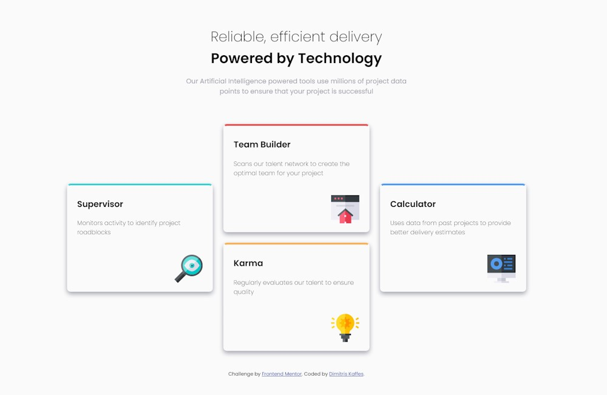

# Frontend Mentor - Four card feature section solution

This is a solution from Dimitris Kaffes to the [Four card feature section challenge on Frontend Mentor](https://www.frontendmentor.io/challenges/four-card-feature-section-weK1eFYK).

## Table of contents

- [Overview](#overview)
  - [The challenge](#the-challenge)
  - [Screenshot](#screenshot)
  - [Links](#links)
- [My process](#my-process)
  - [Built with](#built-with)
  - [What I learned](#what-i-learned)
  - [Continued development](#continued-development)
  - [Useful resources](#useful-resources)
- [Author](#author)

## Overview

Mobile first design approach was implemented for this challenge.

A modern CSS reset (by Andy Bell) was implemented.

A change to a three-column, four-row grid is applied for bigger screens.

### The challenge

Users should be able to:

- View the optimal layout for the site depending on their device's screen size

### Screenshot

### Links

- Solution URL: [four-card-feature-section solution on Github](https://github.com/dkaffes/four-card-feature-section)
- Live Site URL: [four-card-feature-section live site](https://dkaffes.github.io/four-card-feature-section/)

## My process

The HTML structure was built with semantic elements.

Custom properties were used for the colors.

For the `card-container` a `display: grid` property was implemented. The `grid-template-areas` property was used for the grid along with the `grid-area` property for the grid elements. For the mobile view a single column was set.

A media query was used to change the bigger screen layout to a three-column, four-row grid.

### Built with

- Semantic HTML5 markup
- CSS custom properties
- Flexbox
- CSS Grid
- Mobile-first workflow

### What I learned

How to implement a more complex grid structure using the `grid-template-areas`.

### Continued development

Further practise complex grid structures.

### Useful resources

- [MDN - Grid template areas](https://developer.mozilla.org/en-US/docs/Web/CSS/CSS_grid_layout/Grid_template_areas) - The MDN reference on Grid template areas.

## Author

- Frontend Mentor - [@dkaffes](https://www.frontendmentor.io/profile/dkaffes)
